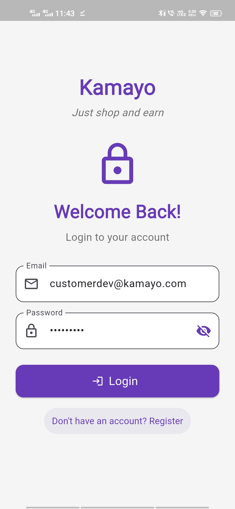
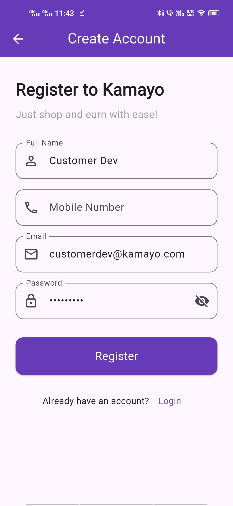
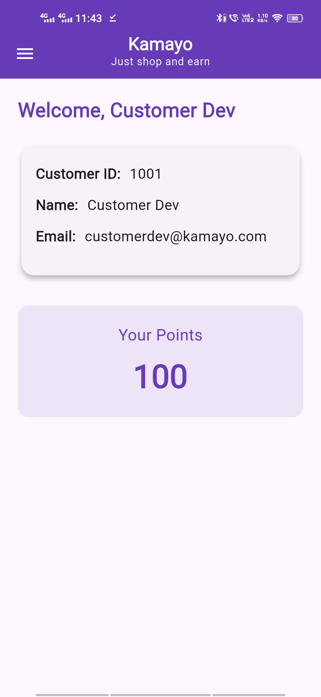

# 🌟 Kamayo

**Kamayo** is a Flutter-based mobile application built with a clean and simple UI.  
It serves as a foundation for creating beautiful, fast, and cross-platform apps for Android and iOS.

---

## 📱 Features

- Simple and elegant user interface  
- Responsive design across different screen sizes  
- Fast performance with Flutter  
- Easy to customize and extend  

---

## 🧩 Screenshots

|  |  |  |  |  |

 


## 🛠️ Getting Started

### 1️⃣ Prerequisites

Make sure you have the following installed:

- [Flutter SDK](https://docs.flutter.dev/get-started/install)
- Android Studio or VS Code
- A connected device or emulator

---

### 2️⃣ Installation

```bash
git clone https://github.com/Devavinash76/kamayo.git
cd kamayo
flutter pub get
